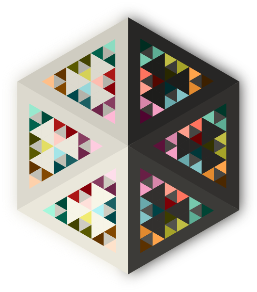

# chiroptera 🦇



## Day/Night color system generator

> [!NOTE]
> Named after bat wings: **two wings** represent dark/light modes, while the
> **membrane tension** between wing bones (patagium) represents hard/normal/soft
> contrast levels. The modes retain closely matched contrast ratios while each
> foreground role stays stable across the contrast variants.

Inspired by

- [gruvbox](https://github.com/morhetz/gruvbox) beautiful colors,
- [solarized](https://ethanschoonover.com/solarized/) light/dark switch and
  color theory
- [base16](https://github.com/chriskempson/base16) color palette idea.

`chiroptera` is a LAB-space color system generator (similar to
[solarized](https://ethanschoonover.com/solarized/)). It keeps perceptual
lightness and contrast relationships stable while switching between light and
dark modes. Like [base16](https://github.com/chriskempson/base16), it exposes
a palette as reusable tokens, so local templates for editors, terminals,
launchers, and dotfiles can share one coherent visual system. The included Vim
colorscheme is its first renderer.

## Features

- 2 themes: light and dark
- 3 levels of contrast: hard, normal, soft
- 18-step color palette with perceptually uniform gradients
- Reusable semantic tokens for text templates and local tools
- Included Vim colorscheme renderer
- 256 colors support
- True color support
- Comprehensive test coverage
- WCAG AA compliant bright colors for syntax highlighting

## Design Philosophy

### Color Variants

The colorscheme uses a three-level variant system for both backgrounds and
foregrounds:

**Background variants** (contrast adjusted by changing background, not
foreground):

- `bg.dim` - Subtle highlight backgrounds (CursorLine, visual selections)
- `bg` - Normal editor background
- `bg.bright` - UI elements (status line, tab bar)

Hard, normal and soft adjust only these background roles and the chromatic
`color.dim` backgrounds. Foreground roles remain fixed within each mode.

**Foreground variants**:

- `fg.dim` - Muted text (comments, line numbers)
- `fg` - Normal text
- `fg.bright` - Emphasized text (directories, highlighted keywords)

**Color variants** (red, green, yellow, blue, magenta, cyan):

- `color.dim` - Used as **backgrounds** for syntax highlighting (low contrast, subtle)
- `color` - Used in **UI messages** (medium contrast)
- `color.bright` - Used as **foreground highlights** (high contrast, WCAG AA compliant)

> [!TIP]
> Use `color.dim` variants as backgrounds for visual differentiation without
> distraction, and `color.bright` variants as foreground text for maximum
> readability.

### LAB Color Space

Colors are generated using **LAB color space interpolation** for perceptually
uniform transitions between light and dark modes. This ensures that:

- Tint progression is visually linear
- Color relationships remain consistent across modes
- Background-to-foreground transitions are smooth

> [!IMPORTANT]
> LAB color space provides better perceptual uniformity than RGB or HSL, making
> color transitions more natural and consistent across different lightness levels.

### Contrast Ratios

The colorscheme prioritizes **readability** with the following WCAG contrast
ratios:

**Dark mode (normal contrast)**:

- `fg` on `bg`: **4.66:1** (meets WCAG AA for normal text)
- `{color}.bright` on `bg`: **≥4.5:1** (all colors meet WCAG AA for highlighted syntax)
- `{color}.dim` on `bg.dim`: **~1.2:1** (intentionally low - subtle background highlights)

**Contrast variants**:

| Mode | Contrast | Background | Foreground | Ratio |
|------|----------|------------|------------|-------|
| dark | hard | `#2d2d2e` | `#a4a29b` | **5.39:1** |
| dark | normal | `#373737` | `#a4a29b` | **4.66:1** |
| dark | soft | `#424141` | `#a4a29b` | **3.98:1** |
| light | hard | `#eae7db` | `#5d5c5a` | **5.39:1** |
| light | normal | `#dddacf` | `#5d5c5a` | **4.77:1** |
| light | soft | `#d0cec3` | `#5d5c5a` | **4.23:1** |

> [!NOTE]
> The `normal` variant meets WCAG AA (4.5:1) for normal text. Contrast ratios
> are closely matched between dark and light modes (difference < 0.25), ensuring
> a consistent reading experience regardless of mode. The `hard` variant
> exceeds WCAG AA for normal text (**~5.3:1**). All bright color variants
> (`color.bright`) meet WCAG AA standards (**≥4.5:1**) for important syntax
> elements. The `soft` variant uses `fg.bright` and `color.bright` for text
> that must meet WCAG AA.

**Bright colors WCAG AA compliance** (for syntax highlighting):

| Color | Dark Mode | Light Mode |
|-------|-----------|------------|
| red.bright | **6.16:1** ✅ | **6.63:1** ✅ |
| green.bright | **6.16:1** ✅ | **6.71:1** ✅ |
| yellow.bright | **6.16:1** ✅ | **6.69:1** ✅ |
| blue.bright | **6.19:1** ✅ | **6.70:1** ✅ |
| magenta.bright | **6.18:1** ✅ | **6.67:1** ✅ |
| cyan.bright | **6.17:1** ✅ | **6.68:1** ✅ |

> [!TIP]
> Use the `hard` contrast variant if you need higher, WCAG AA-compliant
> contrast for normal text.

### Vim Renderer Example

The colorscheme defines a `g:chiroptera` palette structure:

```vim
" Foreground highlights
call s:HL('Normal',       g:chiroptera.fg,        g:chiroptera.bg)
call s:HL('Comment',      g:chiroptera.fg.note,   g:chiroptera.none)
call s:HL('Directory',    g:chiroptera.fg.mark,   g:chiroptera.none)

" Bright colors as foreground highlights
call s:HL('Function',     g:chiroptera.fg.blue,   g:chiroptera.none)
call s:HL('String',       g:chiroptera.fg.green,  g:chiroptera.none)

" Dim colors as background highlights
call s:HL('CursorLine',   g:chiroptera.none,      g:chiroptera.bg.highlight)  " bg.dim
call s:HL('DiffAdd',      g:chiroptera.none,      g:chiroptera.bg.green)      " green.dim
call s:HL('MatchParen',   g:chiroptera.none,      g:chiroptera.bg.blue)       " blue.dim

" UI messages with normal colors
call s:HL('ErrorMsg',     g:chiroptera.ui.red,    g:chiroptera.none)
```

This three-tier system allows for:

- Subtle background highlights that don't distract (`color.dim`)
- Clear foreground syntax highlighting that meets accessibility standards (`color.bright`)
- Consistent UI messaging (`color`)

### Color Semantic Meanings

Each color carries semantic meaning in the colorscheme:

- **Red** - Deleted content, errors (energy, passion, action)
- **Yellow** - Modified content, warnings (mind, intellect)
- **Green** - Added content, success (balance, harmony, growth)
- **Blue** - Selected content, information (trust, responsibility)
- **Magenta** - Input prompts, special keywords (harmony, emotional balance)
- **Cyan** - Output, constants (clarity of thought)

## Installation

### Vim/Neovim

Use your favorite plugin manager. For example, with
[vim-plug](https://github.com/junegunn/vim-plug):

```vim
Plug 'dawikur/chiroptera'
```

Then set the colorscheme:

```vim
" Available colorschemes:
colorscheme chiroptera_dark_hard
colorscheme chiroptera_dark_normal
colorscheme chiroptera_dark_soft
colorscheme chiroptera_light_hard
colorscheme chiroptera_light_normal
colorscheme chiroptera_light_soft
```

After installation, open the built-in documentation with `:help chiroptera`.

## Known Limitations

This is a public beta. The current release has the following boundaries:

- Vim/Neovim is the only included renderer; other tools require a local
  template using the exposed palette tokens.
- Plugin highlight coverage is focused on the integrations currently included
  in `colors/chiroptera/plugins/`; other plugins may need additional groups.
- The `soft` variants intentionally use lower contrast for normal text. Use
  bright foreground roles when WCAG AA contrast is required.
- Terminal appearance depends on terminal color support and Vim/Neovim
  settings. Use `set termguicolors` when true color is available.
- Palette tokens, generated output, and highlight-group choices may change
  during the beta based on visual and accessibility feedback.

## Development

### Requirements

```bash
pip install -r requirements.txt
```

### Generate Colorschemes

```bash
python scripts/generate_chiroptera
```

### Build Distribution Artifacts

```bash
make package
```

### Run Tests

```bash
# Run all tests; fail if coverage drops below 100%
make test

# Check test coverage
pytest --cov=chiroptera --cov-report=html

# Run type checking
mypy chiroptera/

# Line count
cloc chiroptera tests
```

> [!CAUTION]
> Always run tests after modifying color generation logic to ensure contrast
> ratios remain within acceptable ranges.

### Repository Structure

```
chiroptera/
├── bin/                 # CLI tool for viewing palettes
│   └── chiroptera       # Main CLI script (view palettes)
├── colors/              # Generated Vim colorscheme files
│   └── *_tmpl.vim       # Template files for generation
├── chiroptera/          # Python module (color generation)
│   ├── __init__.py      # Package exports
│   ├── ansi.py          # ANSI color code conversion
│   ├── colors.py        # Base colors and LAB color space
│   ├── palette.py       # Palette generation (Mode/Contrast)
│   ├── scheme.py        # Semantic color organization
│   └── utils.py         # Template formatting and image repaletting
├── site/                # Self-contained website and generated assets
├── scripts/             # Build and maintenance scripts
│   └── generate         # Colorscheme generator
├── tests/               # Comprehensive test suite (91 tests)
│   ├── ansi_test.py
│   ├── colors_test.py
│   ├── contrast_test.py
│   ├── coverage_boost_test.py
│   ├── integration_test.py
│   ├── palette_test.py
│   └── scheme_test.py
└── .github/workflows/   # CI/CD configuration
```

### Code Statistics

- **6** Python modules in `chiroptera/`
- **96** tests
- **100%** test coverage for `chiroptera/`
- **100%** mypy strict type checking compliance
- **100%** Python 3.9+ compatible

## API Usage

The Python module can be used programmatically:

```python
import chiroptera as chiro

# Create colors, palette, and scheme
colors = chiro.Colors()
palette = chiro.Palette(chiro.Mode.DARK, chiro.Contrast.NORMAL, colors)
scheme = chiro.Scheme(palette)

# Access palette colors (flat structure)
palette_with_rgb = palette.add_rgb()
print(f"Foreground: {palette_with_rgb['fg']['hex']}")
print(f"Red bright: {palette_with_rgb['red.bright']['hex']}")

# Access scheme colors (semantic structure)
scheme_with_rgb = scheme.add_rgb()
print(f"Foreground normal: {scheme_with_rgb['fg']['normal']['hex']}")
print(f"Background red: {scheme_with_rgb['bg']['red']['hex']}")
print(f"UI blue: {scheme_with_rgb['ui']['blue']['hex']}")

# Flatten for template usage
tokens = {**palette.add_rgb().flatten(), **scheme.add_rgb().flatten()}
print(f"Total tokens: {len(tokens)}")  # 612 tokens available
```

> [!TIP]
> - `Colors`: Generates colors at different lightness levels using LAB color space
> - `Palette`: Flat structure with named colors (fg, bg, red.bright, etc.)
> - `Scheme`: Semantic structure organized by purpose (fg/bg/ui → normal/note/mark)

## License

MIT

## Credits

- Inspired by [gruvbox](https://github.com/morhetz/gruvbox)
  by [@morhetz](https://github.com/morhetz)
- Color theory based on [solarized](https://ethanschoonover.com/solarized/)
  by Ethan Schoonover
- Palette concept from [base16](https://github.com/chriskempson/base16)
  by Chris Kempson
